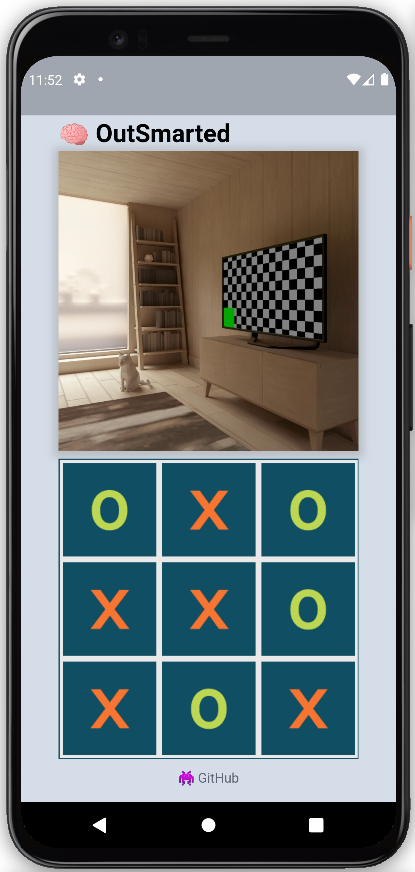

# OutSmarted


### Nächste Schritte
- Jesper: MiniMax mit Listen, BWKI-Bewerbung
- Simon: Server-Endpoint, C4 DQN
- Robert: Schach Alpha-Zero
- Anjo: C4 Datensatz

```
flutter run --release
```

- 🐛 Die Kamera friert ein, sobald die App länger im Hintergrund ist. (statelifecycle in Flutter)

### BW-KI
Titel: OutSmarted

Idee:
Wir bauen eine Smartphone-App, die über die Kamera Brettspiele scannen kann. Sobald das Spiel selbst und sein State erkannt wurde, wird das die optimale Spielverhalten der Nutzer:in angezeigt. Für das Frontend nutzen wir Flutter. Sobald mit dem CameraWidget ein Foto geschossen wurde, wird dieses direkt an unseren Backend-Server geschickt. Hier nutzen wir das Python-Framework Flask. Im ersten Schritt erkennt ein Klassifizierungsmodell das Spiel, um das es sich auf dem Bild handelt. Für den Anfang sind die Klassen TicTacToe, Connect-Four & Chess. Basierend darauf gibt nun ein angepasstestes YOLO-object-detection-Modell, den State des Spieles auf dem Bild an. Der erhaltene State und die ausgewählte Spieler:in wird dann genutzt, um den perfekten Zug zu berechnen. Für TicTacToe nutzen wir dafür den MiniMax-Algorithmus mit Alpha-Beta-Pruning, für Connect-Four ein erweitertes DQN und für Chess Alpha-Zero. Der State und der bestmögliche Zug wird anschließend im Frontend visualisiert.

Daten:
Für die Klassifizierung des Spiels und vor allem die Erkennung des States über object-detection brauchen wir hunderttausende annotierte Fotos. Für TicTacToe haben wir bereits einen ausreichenden Datensatz mit handgezeichneten Spielen zum einen selbst erstellt und zum anderen von Kaggle. Essenziell ist hierbei das nachträgliche Augmentieren übers spiegeln, rotieren und vor allem das zufällige Hinzufügen von Effekten wie die Veränderung der Helligkeit oder der Farbe. Somit können wir unseren Datensatz vertausendfachen. Für Connect-Four und Chess erstellen wir unsere Daten synthetisch über ein Script in Blender. Nur so können wir die große Bandbreite an unterschiedlichen Spielbrettern und Hintergrundkontexten abdecken. Sollten wir unser Chess Reeinforcement-Learning Modell nicht komplett basierend auf Self-Play sondern unterstützt mit Moves auf Profi-Niveau trainieren, haben wir hierfür bereits eine passende Datenbank gefunden. Ähnliches gilt auch für Connect-Four.
