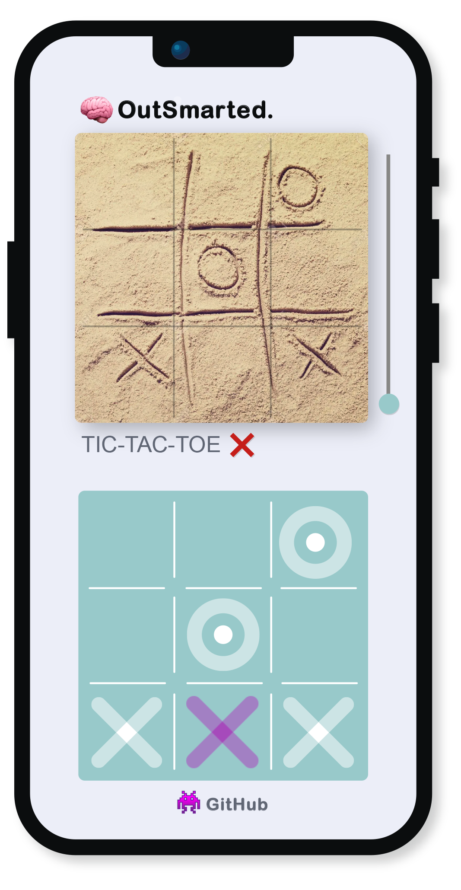
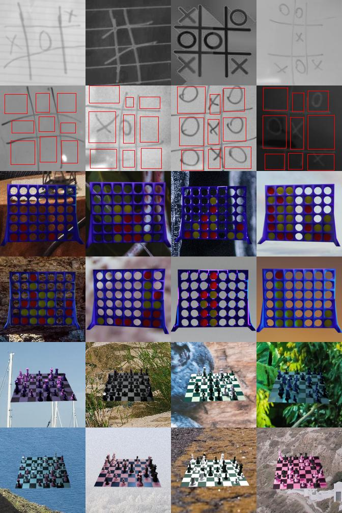
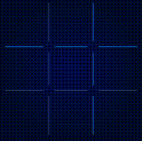

# OutSmarted


### Starten der App mit eigenem Server
#### Starten Sie erst den Flask-Server

Server in Entwicklungsumgebung starten:
```
cd backend
pip install -r requirements.txt
python main.py
```

Oder Server in Produktionsumgebung starten:
```
cd backend
pip install -r requirements.txt
gunicorn --workers 4 --bind 0.0.0.0:30001 wsgi:app
```

Oder Server in Docker starten:
```
cd backend
docker build -t outsmarted .
docker run --net=host outsmarted
```
#### Starten Sie nun die Flutter-App nach dem Verbinden ihres Android-Gerätes.
```
cd outsmarted_app
flutter run --dart-define="SERVER_ENDPOINT=$SERVER_ENDPOINT"
```

Den $SERVER_ENDPOINT (z.B. http://192.168.1.11:5000) sehen Sie beim Starten des Flask-Servers im Terminal und können diesen hier eintragen. Zusätzlich muss sich das Smartphone und der Computer, mit dem der Server gestartet wird, auf dem gleichen Netzwerk befinden.

### Starten der App mit unserem Server
```
cd outsmarted_app
flutter run --release
```

### Individuelle Elemente testen
- [Klassifizierung](https://github.com/foersterrobert/OutSmarted/blob/master/backend/app/Classification/test.ipynb)
- [TicTacToe State-Erkennung](https://github.com/foersterrobert/OutSmarted/blob/master/backend/app/TicTacToe/detect/test.ipynb)
- [TicTacToe MiniMax](https://github.com/foersterrobert/OutSmarted/blob/master/backend/app/TicTacToe/move/test.ipynb)
- [VierGewinnt State-Erkennung](https://github.com/foersterrobert/OutSmarted/blob/master/backend/app/ConnectFour/detect/test.ipynb)
- [VierGewinnt Monte-Carlo-Tree-Search](https://github.com/foersterrobert/OutSmarted/blob/master/backend/app/ConnectFour/move/test.ipynb)
- [Datensatz Visualisierung](https://github.com/foersterrobert/OutSmarted/blob/master/data/test.ipynb)

#### Der Code für die Schach-Erkennung basiert aktuell auf [chesscog](https://www.chesscog.com).


### [AlphaZero](https://www.deepmind.com/blog/alphazero-shedding-new-light-on-chess-shogi-and-go) Nachbau
Parallel zu unserer App haben wir auch eine individuelle Version von AlphaZero entwickelt. Dem vielleicht bedeutensten Reeinforcement Learning-Algorithmus. Dieser funktioniert aktuell out of the box für VierGewinnt and TicTacToe. Und lässt sich ohne Probleme für weitere Spiele anwenden.

Zum trainieren eigener Modelle
```
cd AlphaZero
pip install -r requirements.txt
python main.py
```
Stattdessen können Sie auch die vortrainierten Modelle im [Models](https://github.com/foersterrobert/OutSmarted/tree/master/AlphaZero/Models) Ordner benutzen und in [test.ipynb](https://github.com/foersterrobert/AlphaZero/tree/master/test.ipynb) testen.

---





### [BWKI](https://youtu.be/TZ4DjjEL61w)
Titel: OutSmarted

Idee:
Wir bauen eine Smartphone-App, die über die Kamera Brettspiele scannen kann. Sobald das Spiel selbst und sein State erkannt wurde, wird das die optimale Spielverhalten der Nutzer:in angezeigt. Für das Frontend nutzen wir Flutter. Sobald mit dem CameraWidget ein Foto geschossen wurde, wird dieses direkt an unseren Backend-Server geschickt. Hier nutzen wir das Python-Framework Flask. Im ersten Schritt erkennt ein Klassifizierungsmodell das Spiel, um das es sich auf dem Bild handelt. Für den Anfang sind die Klassen TicTacToe, Connect-Four & Chess. Basierend darauf gibt nun ein angepasstestes YOLO-object-detection-Modell, den State des Spieles auf dem Bild an. Der erhaltene State und die ausgewählte Spieler:in wird dann genutzt, um den perfekten Zug zu berechnen. Für TicTacToe nutzen wir dafür den MiniMax-Algorithmus mit Alpha-Beta-Pruning, für Connect-Four ein erweitertes DQN und für Chess Alpha-Zero. Der State und der bestmögliche Zug wird anschließend im Frontend visualisiert.

Daten:
Für die Klassifizierung des Spiels und vor allem die Erkennung des States über object-detection brauchen wir hunderttausende annotierte Fotos. Für TicTacToe haben wir bereits einen ausreichenden Datensatz mit handgezeichneten Spielen zum einen selbst erstellt und zum anderen von Kaggle. Essenziell ist hierbei das nachträgliche Augmentieren übers spiegeln, rotieren und vor allem das zufällige Hinzufügen von Effekten wie die Veränderung der Helligkeit oder der Farbe. Somit können wir unseren Datensatz vertausendfachen. Für Connect-Four und Chess erstellen wir unsere Daten synthetisch über ein Script in Blender. Nur so können wir die große Bandbreite an unterschiedlichen Spielbrettern und Hintergrundkontexten abdecken. Sollten wir unser Chess Reeinforcement-Learning Modell nicht komplett basierend auf Self-Play sondern unterstützt mit Moves auf Profi-Niveau trainieren, haben wir hierfür bereits eine passende Datenbank gefunden. Ähnliches gilt auch für Connect-Four.

